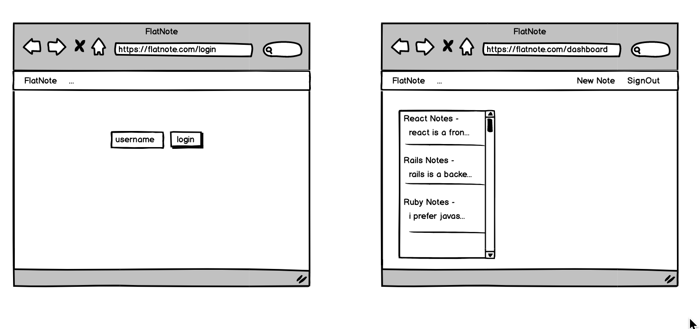

# Mod-4-Pilot-Project 

You've made it! You're ready to build a React application with Redux! Before you start ideating, think about some of the project requirements. 

## Requirements

You've been through quite a few Project Modes by now and should have some idea how to think about scoping a project, what you can accomplish in the designated time, and what is expected of you in terms of meeting complexity requirements.

For this project, you will be creating a to-do list App. You have been provided with wire-framing below, to help guide you towards an MVP. Take a close look at all of the components that you'll need to build and begin thinking about how they might be organized:





and meet the following requirements:

1. Use a _Rails API backend_ with a separate _React frontend_ that are created in two different Github repositories.
2. Have at least three resources on the backend and your application. 
3. You must have full CRUD actions for at least one resource (this will probably be your to-do item).
4. A sign-in page **note - this does not need to be a secure login 


If you create a fully functional MVP and have time left over, you can begin to work on stretch goals. Keep in mind that this is an excellent opportunity for you to practice using tools that you may want to incorporate into your Mod 5 project. Feel free to set your own goals or to attempt any of the following:

- **Strongly Recommended:** Style your App using basic CSS or by incorporating a CSS framework like Bootstrap, Semantic, Material UI, etc.
- **Strongly Recommended:** Refactor your code to use React Router for site navigation. While this isn't required, it will make navigation much easier to handle.
- Add the ability to filter by body, date created, date edited, etc.
- Sorting by date created, date edited, alphabetical, etc.
- Use `react-router` to create a multi-page app
- User signup & login
- Sharing notes with other users
- Rich text formatting
- Tagging
- Emailing notes
- Incorporate a 3rd party API into your project.
      [It is highly suggested that any calls to 3rd party APIs are made _through your backend_.

        Example: A user clicks a button that says 'Get Gifs'
            * React makes a request to Rails
            * Rails makes a request to the Giphy API
            * Rails receives the response from Giphy and sends to React
            * React receives the response from Rails and you do something with it on the client

            This is so you can avoid any *CORS* issues. If you are unable to hit an API from your React app due to a CORS                 restriction, it is very likely that it is impossible to do so. _Brief Refresher on CORS: the idea is that from one              domain (the port your webpack development server is running on) you are not allowed to access another domain.                 You must make the request from a server (i.e. Rails), so the request is exempt from the Same-Origin Policy                      restriction._]
            
       


## Backend Setup
```
rails new <my-project> --api -T --database=postgresql
```

Let's go through this in detail:

* `--api`
  *  Make a [Rails 5 API](http://edgeguides.rubyonrails.org/api_app.html), basically you're telling Rails you don't want any of the stuff you wouldn't need for an application where Rails is not rendering views. Think the ActionView library (`form_for`, `link_to`, etc..), ERB, Security protections that ensure forms were rendered by the Rails app, things like that.
* `-T`
  * don't generate tests for this app
* `--database=postgresql`
  * Set this up to use a Postgres (as opposed to SQLite) database. If you ever want to push this to Heroku, Heroku requires a Postgres database. There won't be too much difference in how you have to write your code. You'll have to be sure to run `rails db:create` and make sure you have postgres running (i.e you can see the elephant)
* Be sure to do the necessary setup for the [rack-cors-gem](https://github.com/cyu/rack-cors)
* You may want to use [active-model-serializers](https://github.com/rails-api/active_model_serializers/tree/0-10-stable)

## Frontend Setup
To create your React project, you may use a tool called [create-react-app](https://github.com/facebookincubator/create-react-app), an awesome project generator developed by Facebook. To use this
+ `npm install -g create-react-app` - this installs the generator as a global package
+ In the directory where you'd like to create your project, `create-react-app my-project-client`. It's that simple!

We'd recommend to begin by removing any of the default stuff given to you by Create React App that you do not understand. The following are some really great resources on how to think about setting up a React project (_Spoiler: They both say the same thing, "There's no right answer!"_)
* [React Docs](https://github.com/reactjs/reactjs.org/blob/71788c647daa07392a8156609fdbede8e9ed24f7/content/docs/faq-structure.md) This was written by Dan Abramov himself <3 <3 <3....
* [The 100% Correct Way to Structure a React App (or why there’s no such thing)](https://hackernoon.com/the-100-correct-way-to-structure-a-react-app-or-why-theres-no-such-thing-3ede534ef1ed)

## Redux Setup
To setup Redux, these packages are required: redux, react-redux, and redux-thunk. Why? The answers are simple.
+ redux is the core that performs the magic 😄
+ By default, React bindings are not included in Redux. With react-redux , these bindings will be explicitly installed.
+ redux-thunk is a middleware that allows you to write action creators that return a function. The returned function receives two store methods: dispatch and getState as parameters. If you’re still unsure about the purpose of redux-thunk, check out the Redux Docs.

+ `npm install redux react-redux redux-thunk --save` - this installs Redux, React-Redux, and Redux-Thunk middleware. If you're unsure about Thunk, go ahead and leave that out.


## Notes
By default both your client app and your rails app will run on port 3000. You'll have to specify one or the other to run on a separate port.
* Rails: `rails s -p <some_number_thats_not_3000>`
* React: Check out this [issue](https://github.com/facebookincubator/create-react-app/issues/1083)

A great article on how [DHH thinks about setting up controllers in Rails](http://jeromedalbert.com/how-dhh-organizes-his-rails-controllers/)
